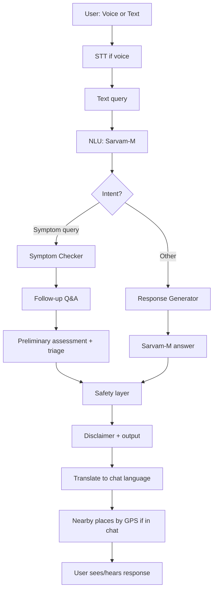

# HealBee

**A voice-based, multilingual AI health companion for accessible healthcare information.**

| | |
|---|---|
| **Web App** | **HealBee** |
| **Author** | **Hari Kishanth R** |
| **Contributors** | *Vishnu Prasaath S, Madheshwaran B, Kristen Sagayaraj V*|

[](https://healbee-ai.streamlit.app/)

**Try it live:** [https://healbee-ai.streamlit.app/](https://healbee-ai.streamlit.app/)

---

## Tech Stack

| Layer | Technology | Purpose |
|-------|------------|---------|
| **Frontend / UI** | Streamlit | Single-page web app: Chatbot, Maps, Journal, Reminders, Settings. |
| **AI / LLM / Voice** | Sarvam AI (Sarvam-M, STT, TTS) | NLU, response generation, speech-to-text and text-to-speech for Indian languages. |
| **Backend / Auth / DB** | Supabase | Auth (email/password), PostgreSQL, RLS; chats, messages, user profile, conversation memory. |
| **Maps & Places** | OpenStreetMap (Nominatim + Overpass API) | Geocoding by city/locality; GPS-based nearby hospitals/clinics within 10 km (no API key). |
| **Runtime** | Python 3.11+ | Core app; dotenv, requests, numpy, scipy, soundfile, pydub, fuzzywuzzy, textdistance, streamlit-mic-recorder. |

---

## Table of Contents

- [What is HealBee?](#what-is-healbee)
- [Why HealBee?](#why-healbee)
- [Who Is It For?](#who-is-it-for)
- [Key Features (In Depth)](#key-features-in-depth)
- [What Makes HealBee Different](#what-makes-healbee-different)
- [Application Structure & User Journey](#application-structure--user-journey)
- [How the Web App Works (Flow)](#how-the-web-app-works-flow)
- [Architecture Diagram](#architecture-diagram)
- [Technologies & Components](#technologies--components)
- [Setup and Running](#setup-and-running)
- [Configuration & Secrets](#configuration--secrets)
- [Safety, Disclaimers & Limitations](#safety-disclaimers--limitations)
- [Project Structure](#project-structure)
- [Testing & Deployment](#testing--deployment)
- [Future Work](#future-work)
- [Credits & License](#credits--license)

---

## What is HealBee?

**HealBee** is a **web application** that acts as a friendly, voice-enabled health companion. Users can ask health-related questions, describe symptoms, or seek wellness guidance in **multiple Indian languages**—via **text or voice**—and receive clear, contextual, and safety-aware responses. The app runs in the browser (Streamlit) and can optionally remember the user (login, chat history, profile) when Supabase is configured.

**In short:**

- **Voice + text** input in **8 Indian languages** (English, हिन्दी, தமிழ், മലയാളം, తెలుగు, ಕನ್ನಡ, मराठी, বাংলা).
- **AI-powered** understanding and answers (Sarvam-M), with strict **no-diagnosis, no-prescription** guardrails.
- **Interactive Symptom Checker** that asks follow-up questions and gives preliminary, triage-style guidance—never a diagnosis.
- **Optional login** to save chats and a simple health profile for more relevant, continuous conversations.
- **Maps**: search by city/locality; in Chatbot, **nearby hospitals/clinics by GPS** (within 10 km), tailored to your concern and shown in **your chosen chat language**.
- **Journal** for health notes; when logged in, notes **persist in Supabase**. Symptom-checker conclusions are **auto-saved as journal entries**; the AI **retrieves past entries** when you reference them (e.g. “I had this problem last week”).
- **Reminders** for medicine, check-ups, or anything you want to remember; **persist in Supabase** when logged in. You can also **set a reminder from chat** (e.g. “remind me to take medicine at 5pm”) and get a clear, translated confirmation.
- **Switch chat language anytime** without losing the current conversation—continue in the same chat in a new language.

HealBee is **not** a medical device, does **not** diagnose or prescribe, and is **not** a substitute for a doctor. It is a **first point of contact** for general health information and awareness, especially where language or access to information is a barrier.

---

## Why HealBee?

In many parts of India (and similar contexts), people face:

- **Language barriers** — Reliable health information is often only in English or a few languages.
- **Limited first-point-of-contact** — It’s hard to get simple, initial guidance before deciding to visit a doctor.
- **Low health literacy** — Complex or text-heavy resources are not accessible to everyone.
- **Skewed doctor–patient ratio** — Doctors are overloaded; non-urgent queries could be partly addressed by safe, general information.

HealBee aims to:

- Reduce the **language barrier** by supporting multiple Indian languages and mixed language (e.g. Hinglish).
- Provide a **friendly first touchpoint** for common health questions and symptom context.
- Improve **health literacy** through clear, conversational answers and disclaimers.
- **Never replace** a doctor—every response reinforces “see a doctor when in doubt” and includes appropriate disclaimers.

---

## Who Is It For?

- **General users** who want quick, reliable health information in their language.
- **Rural or low-connectivity users** who benefit from simple UI and optional voice.
- **Multilingual households** who prefer to ask in Hindi, Tamil, Bengali, etc.
- **Anyone** looking for preliminary symptom context (e.g. “What could fever with cough mean?”) without expecting a diagnosis.
- **Developers / educators** who want to study or extend a voice-based, multilingual health Q&A system built with Streamlit, Sarvam AI, and Supabase.

HealBee is **not** for: emergency care, diagnosis, prescription, or replacing a qualified healthcare provider.

---

## Key Features (In Depth)

### 1. Voice & Multilingual Support

- **Speech-to-Text (STT)** and **Text-to-Speech (TTS)** are powered by **Sarvam AI**, tuned for Indian languages and accents.
- Users can **choose the chat language** (English, हिन्दी, தமிழ், മലയാളം, తెలుగు, ಕನ್ನಡ, मराठी, বাংলা). The AI responds in that language.
- **Mixed language (e.g. Hinglish)** is supported: queries like “mujhe fever hai” are understood and processed.
- **Voice input** in the web app uses the browser microphone (e.g. via `streamlit-mic-recorder`). On environments where local audio libraries are unavailable (e.g. Streamlit Cloud), the app still runs with browser-based voice.

### 2. AI-Powered Chat

- **Natural Language Understanding (NLU)** classifies the user’s intent (e.g. symptom query, general health question, greeting) and extracts entities (symptoms, body parts, etc.) using **Sarvam-M**.
- **Response generation** uses the same LLM with carefully designed **system prompts** (`src/prompts.py`) so answers are helpful, cautious, and aligned with safety rules.
- **Conversation memory**: within a session, the app keeps context (recent messages, last advice). With **Supabase** enabled, chat history and user profile persist across sessions.
- **Language switch without new chat**: You can change the chat language (e.g. English → Tamil) mid-conversation; the **same chat continues** and new responses are in the newly selected language.

### 3. Interactive Symptom Checker

- **Trigger**: When the user describes symptoms (e.g. “I have fever and cough”), the NLU marks the intent as a symptom query and the **Symptom Checker** is activated.
- **Follow-up questions**: The checker uses a structured **symptom knowledge base** (`symptom_knowledge_base.json`) to ask relevant follow-ups (e.g. duration, severity, other symptoms). Coverage includes digestive issues, fever/infections, skin & hair (dandruff, acne, dry skin, pigmentation), women’s health, child health, chronic conditions (e.g. blood sugar, blood pressure), neurological (e.g. Alzheimer’s), and seasonal issues (e.g. heat stroke, dengue-related triage).
- **Preliminary assessment**: Once enough information is collected, the app sends a summary to **Sarvam-M** for a concise interpretation and suggested next steps, augmented with **rule-based triage points** from the knowledge base.
- **Output**: The user gets a clear summary, severity indication, and recommendations—**always** with a disclaimer that this is **not a diagnosis** and that they should consult a doctor.

### 4. Nearby Hospitals/Clinics (Chatbot + Maps)

- **In Chatbot**: After you describe symptoms, an expander **“Nearby hospitals/clinics for your concern (by your location)”** appears. Click **“Use my location and find nearby places”** to share your device’s GPS (not stored). The app fetches **5–6 nearby hospitals/clinics within 10 km** from OpenStreetMap (Overpass API), **tailored to your concern** (e.g. dermatology for skin issues, cardiac for chest pain). Names, addresses, and all UI text are shown in **your selected chat language**. Each result includes phone, website, and “Open map / directions” when available.
- **Maps page**: Enter a **city or locality**; the app uses **Nominatim** to search for hospitals, clinics, and pharmacies. Results show name, type, address, and a link to open directions in OpenStreetMap. No paid Google API is required.

### 5. Optional User Profile

- In the **Chatbot** page, an expander **“Your profile (optional)”** lets users share: name, age, gender, height, weight, ongoing conditions, allergies, pregnancy status (if applicable), and free-form notes.
- This data is **only** used to tailor **tone and relevance** (e.g. age-appropriate language); it is **never** used for diagnosis or medical conclusions.
- When **Supabase** is configured, the profile is stored securely and loaded on next login. Without Supabase, it is session-only.

### 6. Journal (with Chat Integration & Persistence)

- The **Journal** page lets you add **health notes** (title + body) manually. When **Supabase** is configured and you’re logged in, notes **persist** across sessions and devices.
- **Chat-derived entries**: When the **Symptom Checker** concludes a flow, a structured journal entry is **automatically created** (condition summary, symptoms, user experience) in your **chat language**, with a “From chat” badge on the Journal page.
- **Retrieval in chat**: If you refer to past issues (e.g. “I had this problem last week”, “last time you said…”), the app **retrieves relevant journal entries** and passes them to the AI so responses can use that context for continuity. Without login, journal is session-only.

### 7. Reminders (with Chat & Persistence)

- The **Reminders** page lets you add **health reminders** (e.g. take medicine, doctor visit) with a **title**, **date & time**, and optional **note**. You can **mark as done** or **delete**. The UI (including “overdue”) is shown in your **app language**.
- When **Supabase** is configured and you’re logged in, reminders **persist** across sessions; when not logged in, they are session-only.
- **Set reminders from chat**: You can say things like “remind me to take medicine at 5pm” or “remind me tomorrow at 10am for my check-up”. The app detects the request, creates the reminder (and saves to Supabase if logged in), and replies with a **fixed, translated confirmation** (e.g. “I’ve set a reminder for…”).

### 8. Settings & Auth

- **Settings** page: change **app language** (UI labels and navigation in 8 languages), with a note that **chat language** is set on the Chatbot page. When Supabase is enabled, **Logout** is available.
- **Auth**: Optional **email/password** sign-in and registration via **Supabase**. When configured, users can have **multiple chats**, switch between them, and have profile and conversation memory persisted.

---

## What Makes HealBee Different

- **True multilingual chat**: Not just UI translation—the **AI responds in the user’s chosen language** (8 Indian languages), and **hospital/clinic results** from OpenStreetMap are translated into that language too.
- **Same chat, new language**: Change the chat language mid-conversation without losing history; the conversation continues and new replies are in the new language.
- **Location-aware, concern-aware help**: In the Chatbot, **nearby hospitals/clinics within 10 km** are fetched by **GPS**, tailored to the **current symptom/condition** (e.g. dermatology for skin issues), with names and addresses in the user’s language—no extra API keys.
- **Voice + text** with **Sarvam AI** tuned for Indian languages and accents.
- **Structured symptom checker** with follow-up questions and triage-style guidance (never diagnosis), backed by an extensible knowledge base.
- **Optional profile and persistence** (Supabase) for continuous, personalized conversations without locking out users who prefer not to sign in.
- **Reminders** and **Journal** in-app: when logged in, both **persist in Supabase**; you can **set reminders from chat** with a clear confirmation, and the AI **uses journal context** when you reference past issues (e.g. “I had this last week”).

---

## Application Structure & User Journey

The web app has **five main areas** (tabs/pages):

| Page | What the user sees and does |
|------|-----------------------------|
| **Chatbot** | Welcome and disclaimers; chat language selector; optional “Your profile” expander; list of past chats (if logged in); current conversation with HealBee; voice and text input; **Nearby hospitals/clinics** expander (by GPS, within 10 km, in your language); feedback option. |
| **Maps** | Search box for city/locality; “Search” button; list of nearby health places with addresses and “Open map” links. |
| **Journal** | Title and notes to add health notes; list of entries (manual + “From chat” from symptom checker). Persists in Supabase when logged in; AI uses past entries when you reference them in chat. |
| **Reminders** | Add reminder (title, date & time, note); list with “Done” and “Delete”. Persists in Supabase when logged in. Can also set reminders from chat (“remind me to…”). |
| **Settings** | App language dropdown; short caption; Logout button (if Supabase is configured). |

**Typical user journey (Chatbot):**

1. User opens the app → sees welcome and disclaimers.
2. Optionally signs in (if Supabase is set) and/or opens “Your profile” to add basic info.
3. Selects **chat language** (e.g. Tamil).
4. Types or speaks a question (e.g. “I have fever from two days”).
5. App runs STT (if voice), then NLU → either **Symptom Checker** (follow-up questions + assessment) or **direct answer** from Sarvam-M.
6. User can **switch chat language** (e.g. to Hindi)—same chat continues; new responses in Hindi.
7. **Nearby hospitals/clinics** expander appears; user can click “Use my location…” to see 5–6 places within 10 km, in their language, relevant to their concern.

---

## How the Web App Works (Flow)

High-level flow from user input to response:



- **STT**: Voice → text (Sarvam).
- **NLU**: Text → intent + entities (Sarvam-M).
- **Symptom path**: Follow-up questions from knowledge base → summary → LLM + triage rules → assessment + disclaimer.
- **General path**: Prompt built from query + NLU → Sarvam-M → answer + disclaimer.
- **Safety layer**: Ensures disclaimers, blocks diagnosis/prescription, and can redirect to “see a doctor” or emergency messaging.
- **Output**: Translated to user’s chat language; in Chatbot, nearby hospitals/clinics (GPS, 10 km, user’s language) when location is shared.

All of this is orchestrated in the **Streamlit UI** (`src/ui.py`), which calls into `nlu_processor`, `symptom_checker`, `response_generator`, `nominatim_places` (Nominatim + Overpass), and Supabase client as needed.

---

## Architecture Diagram

The diagram below shows how HealBee is structured: from the user in the browser, through the frontend and data layer, to the API and AI/safety layer.


*Place the architecture diagram image at `docs/architecture.png` so it appears above. The diagram illustrates:*

| Layer | What it covers |
|-------|----------------|
| **User** | Access via **mobile or desktop browser** — cross-platform. |
| **Frontend** | **Auth screen** (login/sign-up), **UI & layout** (Chatbot, Maps, Journal, Reminders, Settings), **voice/text input**, **chat & app language selectors**. |
| **Data & Identity** | **Supabase Auth** (sign-in/sign-up), **user profiles** (optional health context), **conversation history** (chats, messages), **user_reminders**, **user_journal_entries**. |
| **API / Session Layer** | **Request handling** (receives and routes requests), **session & context** (conversation state, language, extracted symptoms), **personalization** (profile and history for tone and relevance). |
| **AI & Safety Layer** | **STT** (speech-to-text), **NLU / intent system** (query and entities), **knowledge base** (symptom checker + prompts), **safety & guardrails** (disclaimers, no diagnosis/prescription), **TTS** (text-to-speech). |
| **Places & Maps** | **Nominatim** (city/locality search), **Overpass** (GPS-based nearby hospitals/clinics within 10 km, condition-aware). |

**Flow:** User input (voice or text) goes from the **Frontend** to the **API/Session Layer**, which talks to **Data & Identity** for auth and context. The **AI & Safety Layer** runs STT → NLU → knowledge/LLM → safety checks → output in user’s language. **Places & Maps** is used for Maps page and for the Chatbot’s “nearby hospitals/clinics” (Overpass by GPS). The response is personalized and sent back to the user; conversation history is updated in **Data & Identity**.

---

## Technologies & Components

### Core Stack (Summary)

| Layer | Technology | Purpose |
|-------|------------|---------|
| **UI** | Streamlit | Single-page web app: Chatbot, Maps, Journal, Reminders, Settings. |
| **AI / LLM** | Sarvam AI (Sarvam-M, STT, TTS) | NLU, response generation, voice in/out. |
| **Backend / Auth / DB** | Supabase | Auth (email/password), PostgreSQL, RLS; chats, messages, user memory, user profile, user_reminders, user_journal_entries. |
| **Maps & Nearby** | Nominatim + Overpass (OpenStreetMap) | Geocoding by city; GPS-based nearby hospitals/clinics within 10 km, condition hints. |

### Main Components (Code)

| File / Component | Responsibility |
|------------------|----------------|
| `src/ui.py` | Streamlit app: navigation (5 pages), Chatbot (chat, profile, language, nearby-by-GPS), Maps, Journal, Reminders, Settings, auth gate, theme and styling. |
| `src/nlu_processor.py` | Intent detection and entity extraction using Sarvam-M; Hinglish and config-driven behaviour. |
| `src/response_generator.py` | Builds prompts and calls Sarvam-M for non-symptom queries. |
| `src/symptom_checker.py` | Manages symptom flow: follow-up questions, state, assessment generation, triage. |
| `src/prompts.py` | System and safety prompts for the LLM. |
| `src/supabase_client.py` | Auth (sign-in, sign-up, sign-out), chats, messages, user memory, user profile, user_reminders, user_journal_entries (CRUD). |
| `src/nominatim_places.py` | Nominatim: geocoding and “nearby health places” by city. Overpass: GPS-based search within radius (10 km), condition hints, phone/website when available. |
| `src/utils.py` | Shared helpers (translation via Sarvam, reminder extraction from chat, journal retrieval by time reference and keywords). |
| `src/audio_capture.py` | Optional local audio capture; degrades gracefully when PortAudio is missing (e.g. Streamlit Cloud). |
| `symptom_knowledge_base.json` | Symptoms, keywords, follow-up questions, triage points. |
| `nlu_config.json`, `hinglish_symptoms.json`, `common_misspellings.json` | NLU and text normalization config. |

### Data & Safety Principles

- **No Firebase**; only Supabase, Sarvam, and OpenStreetMap (Nominatim/Overpass).
- **No diagnosis or prescription**; all content is general guidance with disclaimers.
- **Safety layer**: Emergency and diagnosis-request handling; responses steer users to doctors when needed.
- **Profile and memory**: Used only for personalization of tone and context, never for medical conclusions.

---

## Setup and Running

### Prerequisites

- **Python 3.11+**
- **Git** (optional, for cloning)

### Steps

1. **Clone and enter the project**:
   ```bash
   git clone <repository-url>
   cd HealHub
   ```

2. **Create and activate a virtual environment**:
   ```bash
   python -m venv venv
   venv\Scripts\activate          # Windows
   # source venv/bin/activate     # macOS / Linux
   ```

3. **Install dependencies**:
   ```bash
   pip install -r requirements.txt
   ```

4. **Configure environment** (see [Configuration & Secrets](#configuration--secrets)):
   - Copy `.env.example` to `.env`.
   - Set at least `SARVAM_API_KEY`.

5. **Run the web app**:
   ```bash
   streamlit run src/ui.py
   ```
   Open the URL shown (e.g. `http://localhost:8501`).

**CLI (backend-only testing):** `python main.py` — uses mock STT and exercises core logic without the full UI.

---

## Configuration & Secrets

### Environment Variables (`.env`)

| Variable | Required | Description |
|----------|----------|-------------|
| `SARVAM_API_KEY` | **Yes** | From [Sarvam AI dashboard](https://dashboard.sarvam.ai). Used for NLU, responses, STT, TTS. |
| `SUPABASE_URL` | No | Supabase project URL. Enables login and persistence. |
| `SUPABASE_ANON_KEY` | No | Supabase anon key. Enables login and persistence. |

- **Local:** Use `.env`; no `.streamlit/secrets.toml` required.
- **Streamlit Cloud:** In **Settings → Secrets**, add the same variables. The app reads from `st.secrets` when available.

### Optional: Supabase

1. Create a project at [Supabase](https://supabase.com).
2. Run `supabase_schema.sql` in the SQL Editor. It creates tables (`chats`, `messages`, `user_memory`, `user_profile`, `user_reminders`, `user_journal_entries`) and RLS policies. The script is **idempotent** (uses `DROP POLICY IF EXISTS` before each `CREATE POLICY`), so you can re-run it safely if policies already exist.
3. Add `SUPABASE_URL` and `SUPABASE_ANON_KEY` to `.env` or Cloud Secrets.
4. Restart the app; Login/Register and persistence (chats, profile, reminders, journal) will be available.

---

## Safety, Disclaimers & Limitations

### What HealBee Does Not Do

- Does **not** diagnose any condition.
- Does **not** prescribe or recommend specific medications.
- Does **not** replace a doctor or emergency care.

### What HealBee Does

- Provides **general health information** and wellness guidance.
- Offers **preliminary, non-diagnostic** symptom context and triage-style suggestions.
- Encourages users to **consult a qualified healthcare professional** and seek **emergency care** when appropriate.
- Applies **disclaimers** and **safety guardrails** (e.g. emergency detection, diagnosis-request handling).

### Limitations

- **STT/NLU** quality depends on accent, noise, and language mix.
- **Symptom coverage** is limited by the knowledge base and LLM; complex or rare cases may not be fully captured.
- **LLM** can occasionally be wrong or irrelevant; prompts and safety layers mitigate this.
- **Journal** and **Reminders** persist only when Supabase is configured and the user is logged in; otherwise they are session-only.
- **Voice** in the browser typically needs HTTPS and microphone permission.
- **Nearby places** depend on OpenStreetMap data; coverage and accuracy vary by region.

---

## Project Structure

```
HealHub/
├── main.py                     # CLI entry for core logic testing
├── requirements.txt            # Python dependencies
├── pyproject.toml              # Project metadata
├── .env.example                # Env template (no secrets)
├── README.md                   # This file
├── supabase_schema.sql         # Supabase schema and RLS (idempotent; safe to re-run)
├── docs/
│   └── architecture.png        # Place architecture diagram here
├── src/
│   ├── ui.py                   # Streamlit web app (5 pages)
│   ├── nlu_processor.py         # NLU (Sarvam-M)
│   ├── response_generator.py  # General Q&A responses
│   ├── symptom_checker.py      # Symptom flow and assessment
│   ├── prompts.py              # System/safety prompts
│   ├── supabase_client.py      # Auth, chats, profile, memory
│   ├── nominatim_places.py     # Maps (Nominatim + Overpass)
│   ├── audio_capture.py        # Optional local audio
│   ├── utils.py                # Shared utilities
│   ├── nlu_config.json
│   ├── symptom_knowledge_base.json
│   ├── hinglish_symptoms.json
│   └── common_misspellings.json
└── tests/
    ├── test_nlu_corrections.py
    ├── test_nlu_hinglish.py
    ├── test_evaluation.py
    └── test_data/
```

---

## Testing & Deployment

- **Testing:** See **TESTING.md** for NLU, Hinglish, and evaluation tests.
- **Live app:** [https://healbee-ai.streamlit.app/](https://healbee-ai.streamlit.app/)
- **Deployment (Streamlit Community Cloud):**
  1. Push repo to GitHub and connect to [Streamlit Community Cloud](https://share.streamlit.io/).
  2. Set **Main file path** to `src/ui.py`.
  3. Add **Secrets**: `SARVAM_API_KEY` (required), optionally `SUPABASE_URL`, `SUPABASE_ANON_KEY`.
  4. Deploy; app runs as `streamlit run src/ui.py`.

On Streamlit Cloud, browser-based voice works; local `sounddevice` is optional and disabled when PortAudio is unavailable.

---

## Future Work

- Expand **symptom knowledge base** and language coverage.
- Optional **RAG** for curated medical reference with strict safety.
- Stronger **NLU** for mixed languages (Hinglish, Tanglish, etc.).
- **UI/UX** and optional mobile-friendly layout.
- Optional **notification hooks** for reminders (e.g. browser or push notifications).
- **Integrations** (e.g. telemedicine links) with user consent and privacy.

---

## Credits & License

| Role | Name |
|------|------|
| **Author** | **Hari Kishanth R** |
| **Contributors** | Vishnu Prasaath S , Madheshwaran B , Kristen Sagayaraj V|

**License:** See **LICENSE** in the repository.

---

*HealBee is for general health information only. It is not a medical device and does not provide diagnosis or treatment. When in doubt, see a doctor.*
